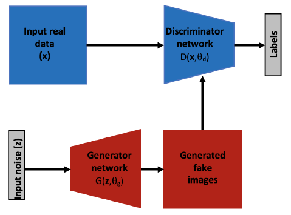

# 2.1.4 生成对抗网络

生成对抗网络（GANs）是利用多层结构的强表达能力的相对较新的模型。GANs首先是在2014年被提出\[2014\]，虽然其本身并没有提出新的架构（例如，在新颖的网络构建块方面），但是它具有一定的特殊性，这使它略微不同于其它多层架构。GANs试图解决的是使用无标签数据进行学习的无监督学习问题。 典型的GAN由两个计算模块或子网络组成，如图2.7所示；一个生成网络，$$G\left(z;\theta_{g}\right)$$,及一个判别网络，$$D\left(x;\theta_{d}\right)$$,这里$$z$$是一个随机噪声，$$x$$是一个真实的输入数据（例如一张图像），$$\theta_{g}$$及$$\theta_{d}$$是这两部分网络的参数。每个部分都可以由之前定义的多层结构组成。在最初的论文中，生成器及判别器都是多层全连接网络。判别器$$D$$被训练出来去将从生成器中生成的样本标记为“_fake_”的概率为$$p_{d}$$,而将真正的样本标记为“_real_”的概率为$$1-p_{d}$$。需要补充的是，生成网络需要不断地去优化以使生成的假样本更能欺骗判别器。这两部分通过不断地交替训练，训练过程的理想状态是到达判别器对真假数据都给与50%的概率。也就是说，在网络收敛之后，生成器应该能够根据随机输入输出真实的数据。 

在最初的生成对抗网络之后，很多使用能力更强的多层框架作为基础网络来增强GANs的能力的模型被提出\[114\]（例如使用预训练的卷积神经网络作为判别器，而用来上采样的反卷积神经网络作为生成器）。一些成功的使用GANs的案例有：文本生成图像（即通过图像的文本描述信息从而生成图像\[115\]），或者从低分辨率的图像生成高分辨率的图像\[94\]，GANs还可以用来修复具有信息缺失的输入图像及合成逼真的纹理。

