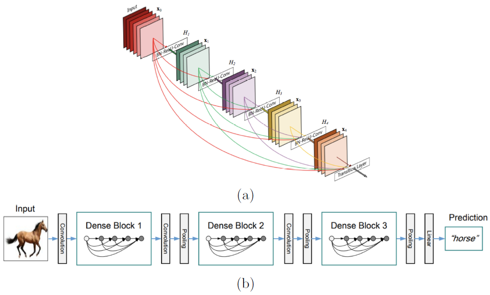

# 2.2.1 目前的卷积神经网络的一些主流架构

使卷积神经网络得到重新复兴的当属Krishevsky的AlexNet\[88\]。AlexNet在当时成功的打破了ImageNet物体识别的记录。它总共由8层，其中5层卷积及3层全连接层，如图2.8所示。 AlexNet提出了一些架构设计的方向，这使得可以使用随机梯度下降法可以高效地训练网络。其中有4点对AlexNet的成功起了关键的作用。1、AlexNet使用ReLU激活函数来代替其他的饱和非线性函数如之前的最先进的一些卷积神经网络（如LeNet\[91\]）所使用的sigmoid激活函数。ReLU的使用在一定程度上减轻了梯度消失的效果且提升了网络的训练速度。2、由于在网络的全连接层有着大量的参数，AlexNet使用了dropout（最先在文献\[136\]中被提出来），来减少过拟合的影响。AlexNet中使用的dropout通过随机的降低（或者说是置为0）给定层的参数的占比。该技术使得在每次训练时的网络结构都有所不同而且在每次训练中都人为的减少了所要学习的参数，这在一定程度上打破了各个单元之间的联系从而防止了过拟合。3、AlexNet通过使用数据增强技术来提高了网络的不变性的能力。例如，网络不仅仅在原始数据集上进行训练，还要在翻转及光照变换后改变的图像上进行训练。4、AlexNet使用了一些技术使得整个训练过程更快速，例如使用momentum优化算法及设置学习率随着训练过程而逐渐降低。 

AlexNet的出现导致通过可视化来了解网络是如何学习的论文数量激增，如所谓的DeConvNet\[154\]，或者是对各种框架的系统探索\[22,23\]。在这些探索中，最直接的一个结果是越深的网络所达到的效果也就越好，这一观点首先在19层的VGG-Net\[135\]中被阐释。VGG-Net仅仅是在准从AlexNet的设计理念（如使用ReLU及数据增强技术）上增加了更多的层来达到更深。VGG-Net中最新颖的地方是在于使用了更小的滤波器（例如在整个网络中都使用$$3\times3$$的滤波器来代替AlexNet中的$$11\times11$$的滤波器），这使得网络的深度得到增加的同时并没有增加网络所需要学习的参数的数量。需要注意的是，当使用更小的滤波器时，VGG-Net每层所需的滤波器数量也要增加。 VGG-Net是继AlexNet之后第一个出现的最简单的卷积神经网络架构。更深的架构，如大家所熟知的有22层的GoogLeNet提出的要晚一些\[138\]。虽然比VGG-Net更深，但是GoogLeNet需要学习的参数相较来说更少，由于其采用了inception模型作为基础块，如图2.9（a）所示。在inception中，各种尺度的卷积运算及空间池化并行进行。该模型还是用了$$1\times1$$的卷积（跨通道池化）来实现对降维从而避免冗余的滤波器，从而控制网络的尺寸的大小。跨通道池化的思想受到先前的Network in Network（NiN）\[96\]的影响，该模型弥补了在网络学习中的大量冗余的问题。堆叠大量inception模型实现了目前被广泛使用的GoogLeNet框架，其结构如图2.9（b）所示。 

GoogLeNet是第一个摒弃了简单堆叠卷积及池化层的网络，但是很快就有一个更深的模型同样摒弃了这一策略，那就是广为大家所知的ResNet\[64\]，它通过使用一种全新的架构是的网络达到了150层。ResNet代表着残差网络，其主要的贡献在于其依赖于残差学习。特别的是，ResNet的每层都会在输入$$x$$上按照下面的公式学习一个增量变换$$F\left(x\right)$$：
$$
H\left(x\right)=F\left(x\right)+x\tag {2.15}
$$
而不是像其他卷积神经网络一样直接学习这种变换$$H\left(x\right)$$。残差学习通过跳跃连接来连通，如图2.10（a）所示，通过使用一个恒等映射来连接不同层。信号$$x$$的直接传播，可以有效地防止反向传播中的梯度消失现象，因此可以用来训练很深的架构。 

最近，和ResNet有很大联系的DenseNet\[72\]，使残差连接的思想得到又一提升。在DenseNet中，网络的每一层都通过跳跃连接来连接到密集块的后续层，密集块的示意图如图2.11。特别的是，一个密集块连接着所有层有相同大小的特征图（在空间池化层之间的部分）。和ResNet不同的是，DenseNet不是像式（2.15）那样将前面层的特征图加上去，而是将所有特征图拼接在一起来让神经网络学习到一个新的表示：
$$
H(x_{l})=F(x_{l-1},...,x_{1},x_{0})\tag {2.16}
$$
作者说这种策略可以使DenseNet在每一层使用更少的滤波器，因为通过将在一层提取的特征推送到更高层的其他层可以避免提取可能的冗余信息。重要的是，这些跳跃连接使得梯度可以更好的流入到较低层，由于它们和损失函数之间有直接连接。这种做法使得DenseNet可以和其他深层框架相比较，例如ResNet，但是其所需要的参数会减少这也导致了更小的过拟合现象。 

